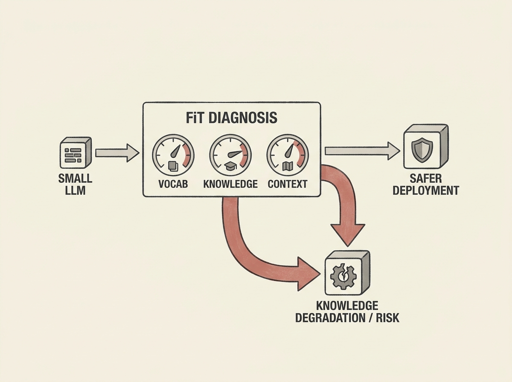

Do not fine-tune your small LLMs blindly for critical domains. It can actively degrade their core knowledge.

A new diagnostic framework called FiT (Find before Fine-Tune) helps characterize small LLMs across vocabulary, parametric knowledge, and contextualization *before* adaptation. This is crucial for domains like cybersecurity QA, where precision and reliability are paramount.

The research reveals that fine-tuning does not uniformly help. It consistently degrades vocabulary and parametric knowledge in small models, with different fine-tuning regimes (knowledge-focused vs. instruction-focused) leading to distinct trade-offs. For instance, instruction-focused tuning can collapse measured knowledge through induced abstention.

Pre-fine-tuning FiT scores can predict the direction of these changes. This means you can screen out unsuitable models, avoid unnecessary fine-tuning costs, and ensure safer deployment of LLMs in critical applications. It is an essential read for anyone responsible for fine-tuning and integrating LLMs into production systems.