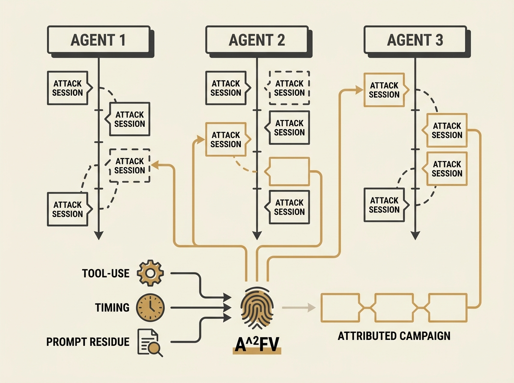

Defending LLM agents in production is harder than it seems. Attacks are not always isolated sessions; they can be distributed asynchronously across multiple agents, making attribution difficult without shared runtime state.

A new paper formalizes "cross-agent asynchronous campaign attribution" and introduces $A^2FV$ (Asynchronous Attribution Fingerprint Vectors). This lightweight proxy-side protocol uses tool-use, timing, and prompt residue to link attack sessions, achieving 0.82 pairwise AUC.

This is crucial for building robust and secure agentic systems at scale.