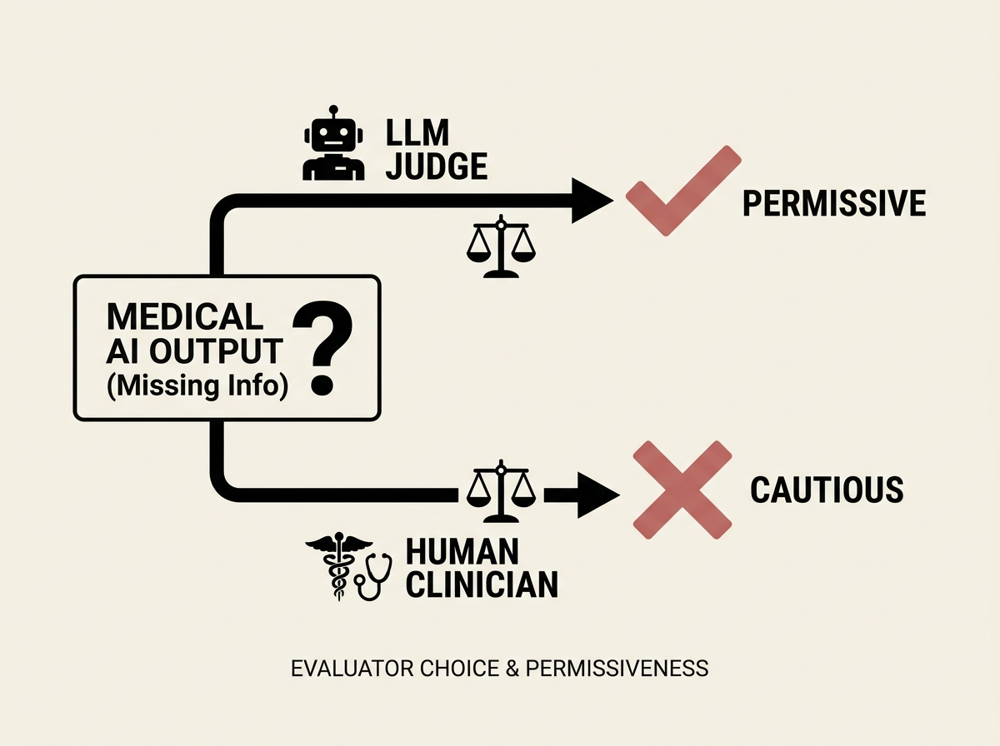

Evaluating medical AI for safety, especially under missing information, presents unique challenges. A recent study stress-tested leading LLMs and found that the choice of evaluator dramatically changes apparent safety.

LLM judges, for instance, were consistently more permissive than human clinicians when assessing an AI's ability to qualify or clarify when information was absent. Inter-judge agreement was only moderate, and same-provider judges showed bias.

This underscores the critical importance of rigorous, unbiased evaluation protocols for any AI deployed in sensitive domains.