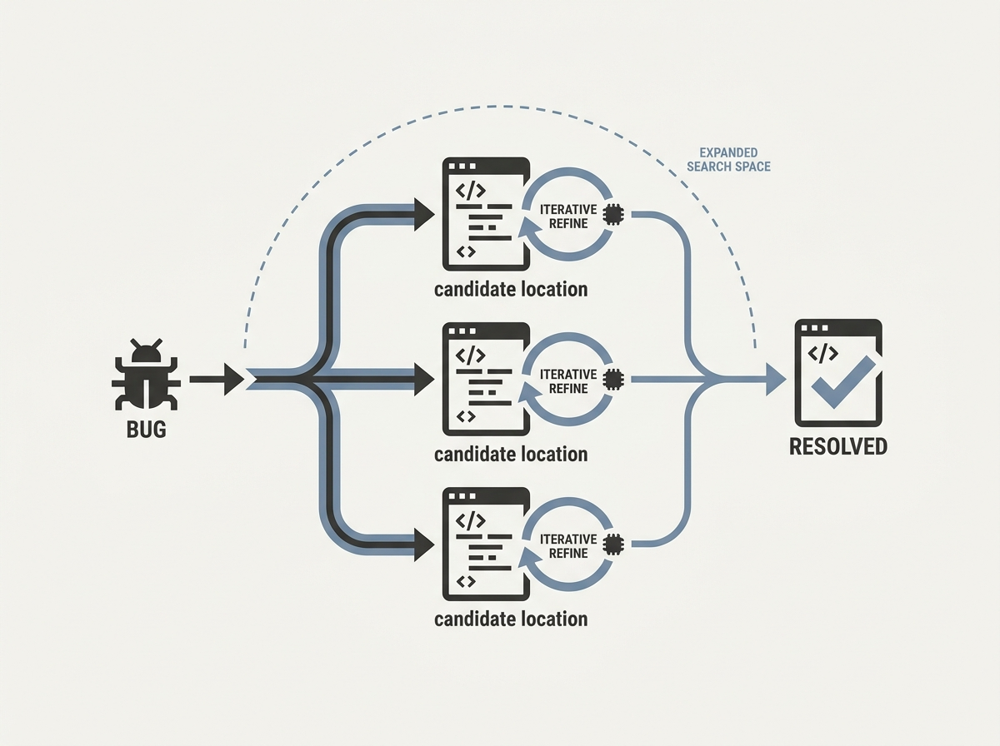

Automating software repair with LLM agents has been a holy grail for developer productivity, but current methods often fall short due to insufficient exploration of repair strategies. PhoenixRepair introduces a multi-agent framework that rethinks this process.

This system systematically explores multiple candidate edit locations in the codebase. Crucially, it then performs iterative reflection and refinement on patch generation, vastly expanding the search space for potential fixes.

On SWE-bench-Verified, PhoenixRepair achieved a 7.8 percent relative improvement over SWE-agent and hit a 76.0 percent Pass@1 rate with MiniMax-M2.5. This demonstrates a significant leap in the ability of AI agents to autonomously debug and fix software, turning an aspirational goal into a tangible engineering tool.