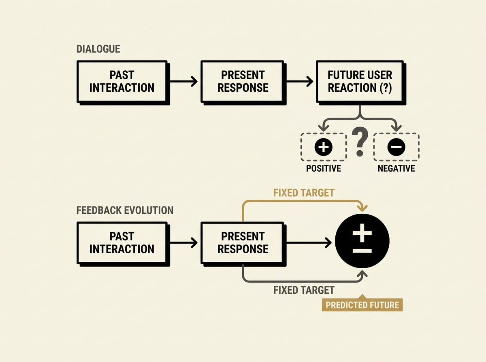

Evolving AI agent skills in open-ended dialogue is notoriously hard because user reactions change based on the agent's response, making counterfactual evaluation difficult. You cannot easily test if a different response would have been better.

This paper presents a clever solution: 'future-feedback skill evolution.' Instead of trying to prescribe the current best answer, the agent learns to predict whether its observed answer will lead to positive or negative user feedback down the line. This prediction task is verifiable on fixed logged data, allowing for stable, offline optimization.

This approach provides an interpretable feedback skill that can then guide the optimization of the main answer skills. On a real-world sales assistant dataset, this method achieved over 75 percent prediction accuracy, enabling reproducible skill evolution without risky live traffic experiments.

This is a significant step forward for anyone deploying and iteratively improving conversational AI agents, offering a robust way to learn from user interactions.