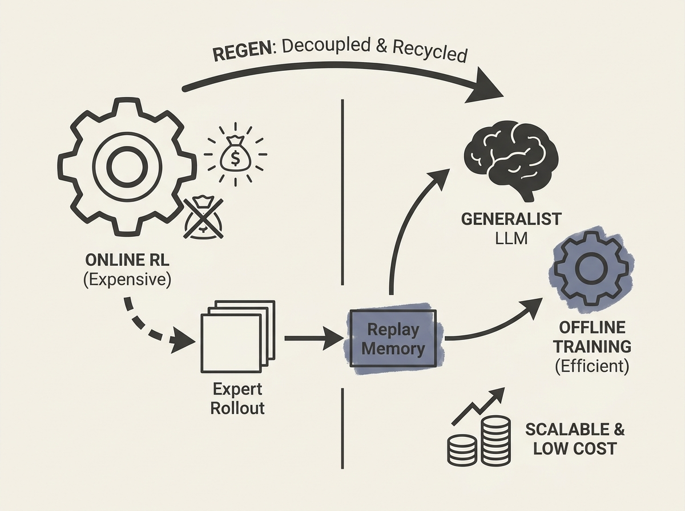

Scaling online Reinforcement Learning for LLM agents is a massive computational challenge. REGEN offers a compelling solution by turning online RL into a *data synthesis* process, drastically cutting training costs.

REGEN, or Replay-recycling for Expert-to-Generalist distillation, proposes training a generalist LLM by simply reusing the replay memory generated by expert RL agents. This is a game-changer because it completely decouples the expensive rollout sampling from the backward training process.

Instead of needing coupled inference and backward passes for distillation (like MOPD), REGEN leverages offline RL algorithms with pre-collected expert data. This significantly reduces the training cost, allowing you to achieve similar accuracy in mathematical reasoning, code generation, and instruction following, but at a fraction of the expense.

This innovation could pave the way for more widespread and affordable development of highly capable, agentic LLMs.