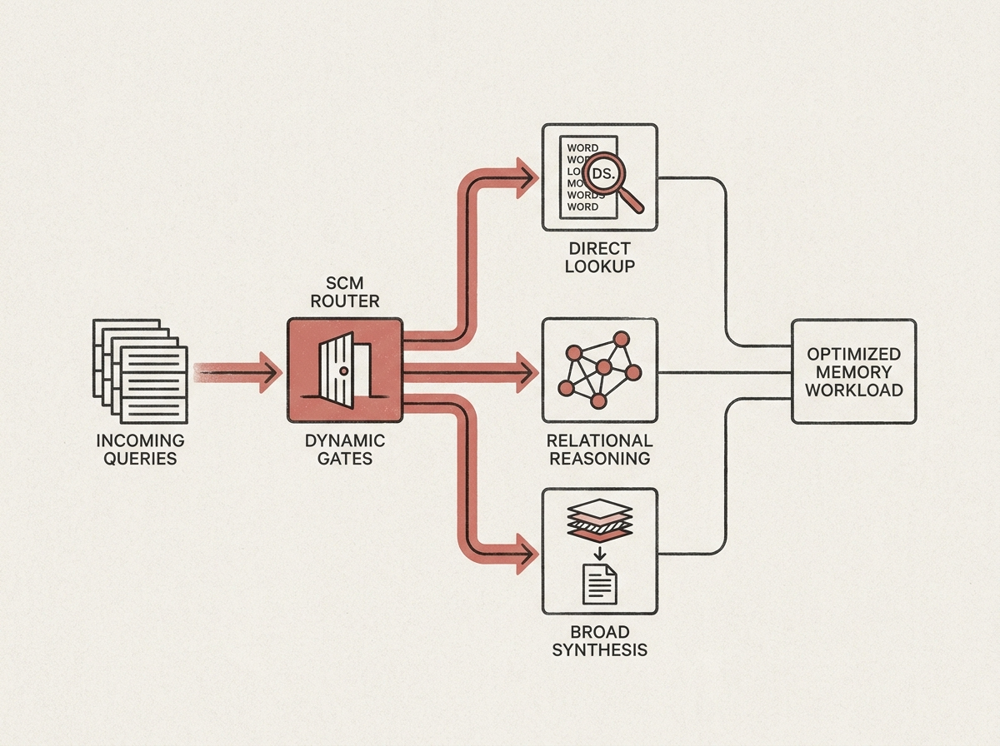

Designing effective memory for AI agents is a complex challenge, often requiring a mix of direct lookup, relational reasoning, and broad synthesis. The Supra Cognitive Modes (SCM) architecture offers an intelligent solution.

SCM is a routed architecture that dynamically maps each query to the most appropriate "cognitive mode" for retrieval and synthesis. Imagine a system that can automatically decide whether to perform a lexical search, traverse a knowledge graph for multi-hop reasoning, or execute a stratified long-form synthesis.

This intelligent routing is enabled by a frozen semantic classifier and runtime gates, all operating over a shared, multi-granularity ingest substrate. This means efficient handling of diverse memory workloads, from simple factoids to complex reasoning.

If you are building advanced AI agents, understanding architectures like SCM can provide a blueprint for creating more robust and capable memory systems.