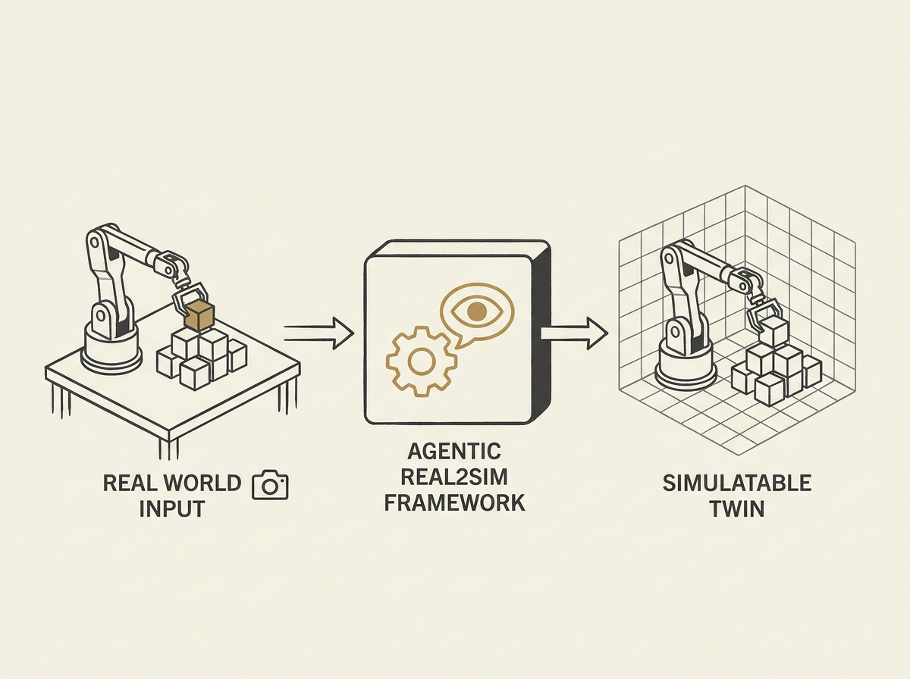

Converting real-world robotic interactions into high-fidelity simulations is a labor-intensive bottleneck, often demanding manual tuning and brittle glue code. Agentic Real2Sim tackles this by introducing a framework that leverages vision-language agents to automate the entire process.