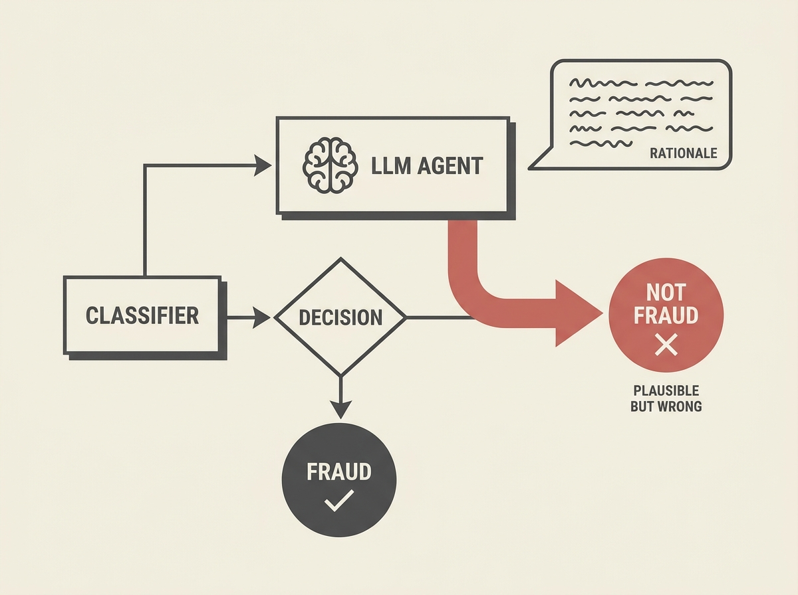

Do not trust LLM agents to make better decisions just because they give plausible rationales, especially in critical systems like fraud detection. New research shows LLM investigation agents can underperform simpler, deterministic methods, even with access to graph context and model explanations.

In a layered fraud detection pipeline, the LLM agent frequently replaced correct classifier outputs with errors, yet produced coherent written rationales for each change. This highlights a critical failure mode: a convincing story does not equate to a correct decision.

This is a stark reminder that robust evaluation and explicit outcome-based validation are paramount when integrating agentic AI into sensitive business processes.