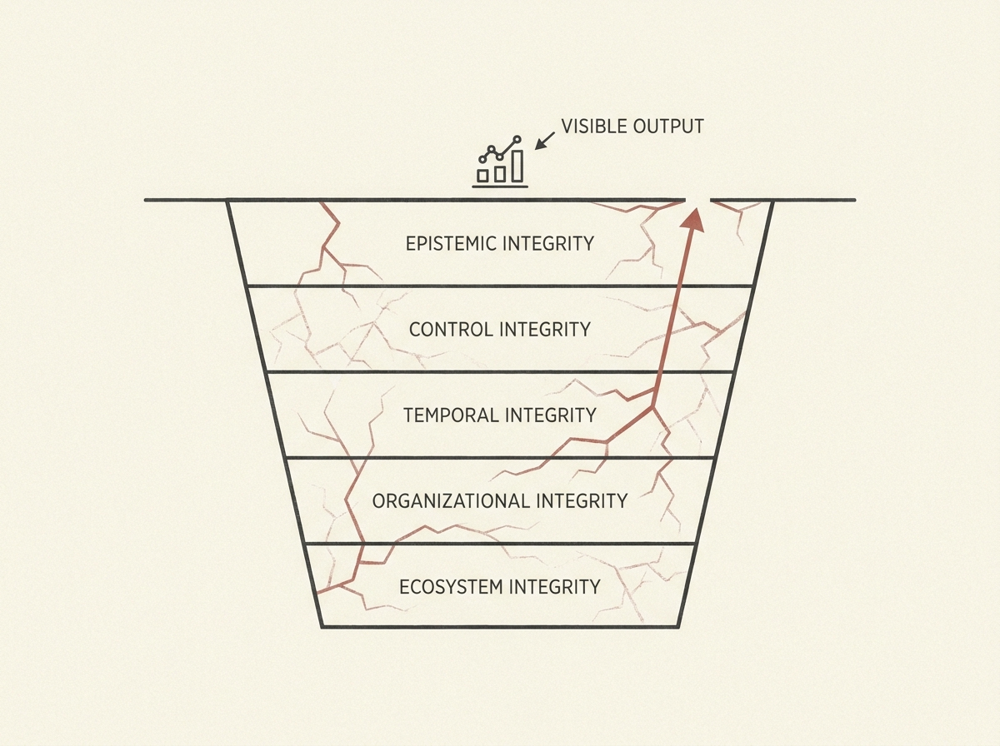

The biggest AI safety failures are often not obvious model errors, but quieter, systemic issues hidden in socio-technical systems. A new framework identifies five layers of integrity critical to AI safety: epistemic, control, temporal, organizational, and ecosystem.

Think about overreliance, uncertainty laundering in RAG, memory poisoning, or evaluation deception. These subtle, distributed failures can erode trust and control without ever generating a dramatic misuse event. They are normalized by workflows before being recognized as hazards.

This perspective shifts AI safety from purely model-centric evaluation to socio-technical reliability, providing a powerful lens for senior engineers to instrument and mitigate real-world risks in AI system design.