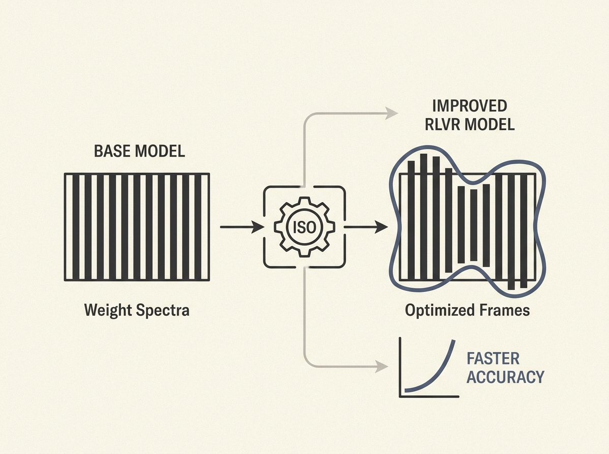

The optimization layer for converting reward feedback into weight updates in RLVR for LLMs has been a black box, but Isospectral Optimization (ISO) offers a breakthrough. This framework allows RLVR to reuse a base model's weight spectra, acquiring new behaviors by optimizing associated input and output singular frames.

This spectral inheritance approach means that models can reach matched scores with substantially fewer training steps. For instance, on Qwen3-8B-Base, ISO-AdamW achieved the same aggregate accuracy as standard AdamW in only 100 steps compared to 270, and improved further to 0.509 after 210 steps.

ISO provides both offline and online instantiations, demonstrating its versatility. It is a concrete answer to RLVR's missing optimization layer: design post-training around reward-driven adaptation by inheriting the spectrum and optimizing the frames.

This could dramatically reduce the computational cost and time required for fine-tuning large language models, making advanced reasoning and coding capabilities more accessible and efficient.