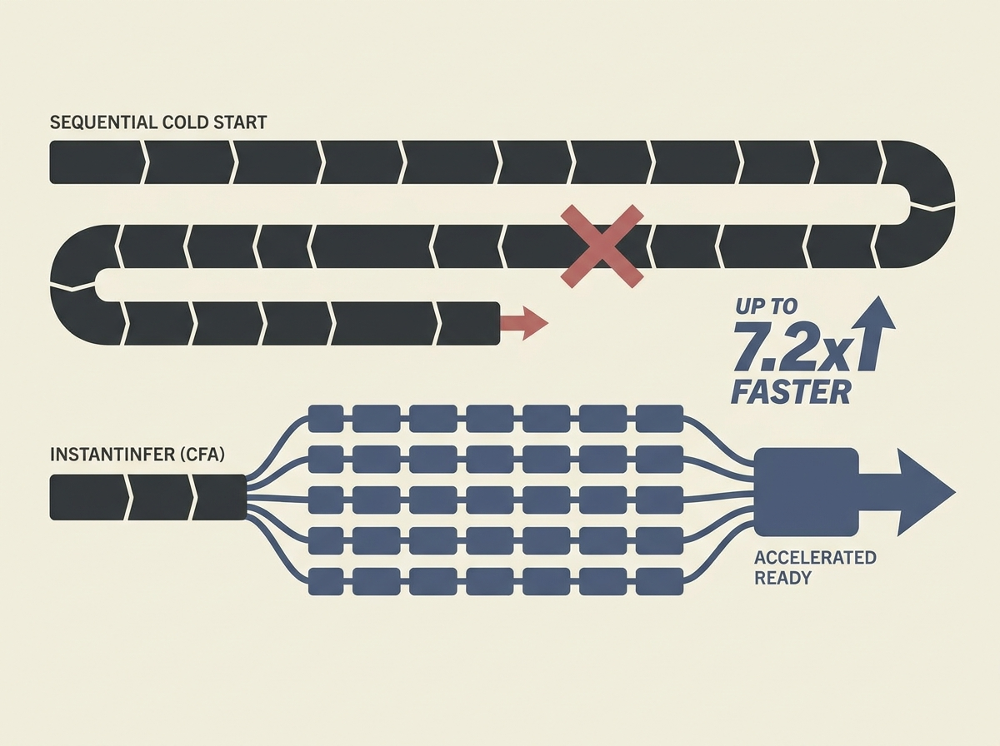

LLM cold starts are a major pain point, but this paper introduces InstantInfer, a system that slashes them by up to 7.2 times. It does this by using a clever Communicating Finite Automata (CFA) abstraction to refactor complex LLM components. This enables safe concurrent execution and I/O merging without rewriting the entire program, tackling sequential initialization bottlenecks head-on. If you are deploying LLMs in production, this is a game-changer for user experience. The approach is systematic, not ad-hoc, promising robust improvements across various GPUs and workloads.