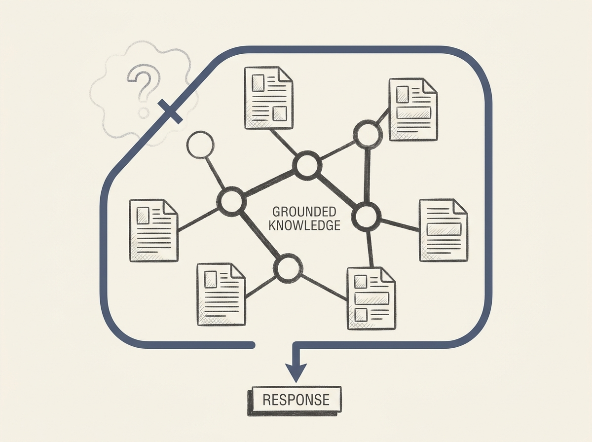

GraphRAG holds immense promise for long-document Q&A, but automatically constructed graphs are often incomplete and can lead to unreliable answers. PAGE-RAG introduces a crucial framework to make these systems robust and trustworthy.

The core idea is to treat graph structures not as replacements for source documents, but as "semantic skeletons" to organize and navigate knowledge. This changes the game for how retrieval works.

PAGE-RAG features a task-adaptive retrieval routing strategy that dynamically selects the best retrieval behavior based on the query. Even more important is its strict knowledge boundary control, which ensures generated responses are always grounded in available evidence, actively preventing hallucination beyond accessible knowledge.

This framework offers competitive answer quality while significantly boosting retrieval efficiency and, critically, knowledge reliability. For engineers building RAG systems that need to handle complex, long-form content, PAGE-RAG provides concrete strategies for achieving greater trust and performance.

This is a step forward for reliable AI.