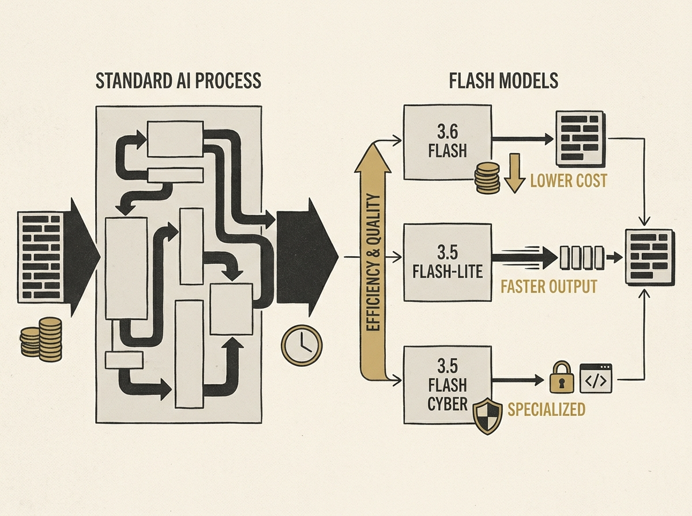

---
authors:
- Tulsee Doshi
comments: https://news.ycombinator.com/item?id=48993414
date: '2026-07-21'
hn_id: '48993414'
image: 66-hn-48993414-infographic.png
interest_score: 7
section: ai
source: hn
tags:
- ai-agents
- catchup
- cybersecurity
- gemini-models
- hn
- model-efficiency
- multimodal-ai
title: New Gemini Flash models boost efficiency and quality for AI agents
url: https://blog.google/innovation-and-ai/models-and-research/gemini-models/gemini-3-6-flash-3-5-flash-lite-3-5-flash-cyber/
why_read: This announcement introduces new Gemini Flash models (3.6 Flash, 3.5 Flash-Lite,
  3.5 Flash Cyber) designed to enhance AI agent development with improved efficiency,
  lower latency, and better performance across various applications, including coding,
  knowledge work, and cybersecurity. Readers will learn about the specific benefits
  and use cases of these latest models and upcoming advancements.
---

Building effective AI agents at scale requires models optimized for efficiency and low latency. Google's new Gemini Flash models, including 3.6 Flash, 3.5 Flash-Lite, and 3.5 Flash Cyber, are engineered precisely for this purpose.

The 3.6 Flash model reduces output token usage by 17 percent, and up to 65 percent in some benchmarks, at a lower cost per output token. The 3.5 Flash-Lite delivers 350 output tokens per second, making it incredibly fast.

A notable addition is the 3.5 Flash Cyber model, specialized for cybersecurity applications and paired with the CodeMender code security agent, delivering competitive performance at the frontier. These advancements offer tangible improvements for developers focused on production agent systems.

This release underscores a clear industry trend toward highly efficient, purpose-built models for real-world agentic workflows.