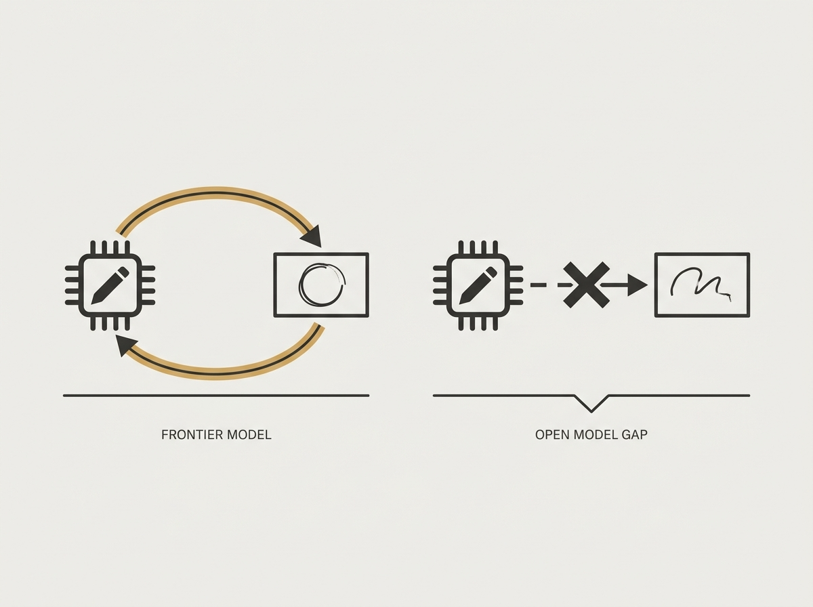

---
authors:
- hershyb_
comments: https://news.ycombinator.com/item?id=48998404
date: '2026-07-21'
hn_id: '48998404'
image: 67-hn-48998404-infographic.png
interest_score: 7
section: ai
source: hn
tags:
- ai-drawing
- catchup
- cost-analysis
- frontier-models
- hn
- model-evaluation
- tool-use
- vision-models
title: AI models demonstrate varied drawing skill and cost in open-ended tasks
url: https://www.tryai.dev/blog/ai-drawing-arena-colored-pencils-claude-gpt-grok
why_read: This article details an experiment testing various AI models in open-ended
  drawing tasks, providing insights into their capabilities, tool use, and operational
  costs. Readers will learn about the performance differences among frontier models
  and how they handle creative challenges.
---

Evaluating LLM capabilities on complex, iterative tasks with tools shows fascinating differences. A "drawing arena" where models use colored pencils, smudge, and erase to reproduce images reveals unexpected strengths and weaknesses.

GPT-5.6 Sol and Claude Fable 5 showed impressive iterative improvement, often refining their strokes after viewing the canvas. In contrast, Grok 4.5 struggled significantly with basic tool manipulation, highlighting the real frontier-versus-open gap.

This empirical approach goes beyond benchmarks, demonstrating how models truly perform when faced with an open-ended problem requiring tool use and self-correction, which is critical for agentic AI applications.