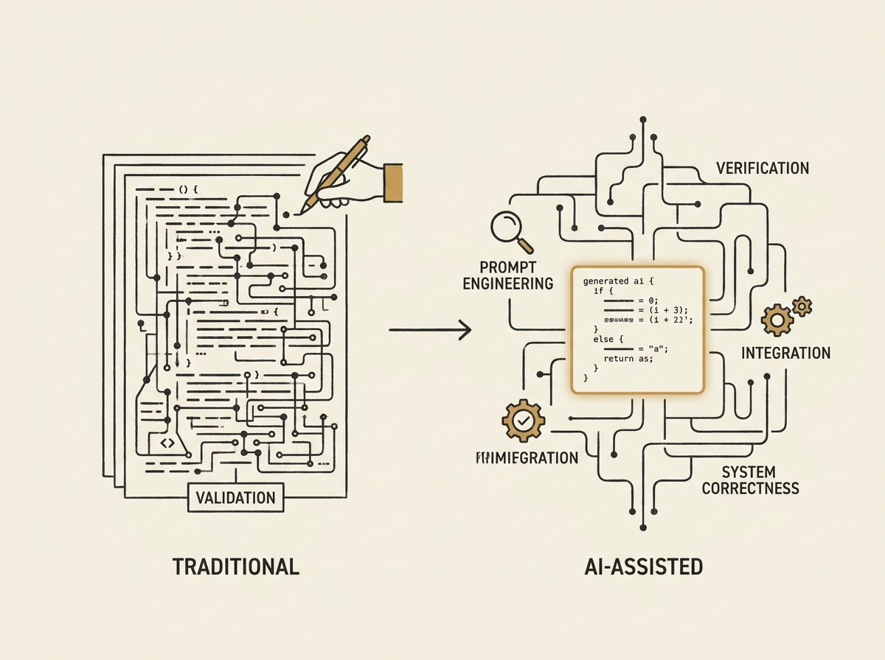

---
authors:
- tchalla
comments: https://news.ycombinator.com/item?id=48996197
date: '2026-07-21'
hn_id: '48996197'
image: 68-hn-48996197-infographic.png
interest_score: 7
section: engineering
source: hn
tags:
- ai
- catchup
- difficulty
- hn
- programming
title: AI makes programming differently difficult
url: https://cacm.acm.org/opinion/ai-didnt-make-programming-easier-it-just-made-it-differently-difficult/
why_read: This statement suggests that AI introduces new kinds of problems or changes
  the nature of existing ones in programming. It provokes thought on the evolving
  challenges developers face.
---

AI will not make programming 'easier' in the long run; it simply makes it 'differently difficult.' This perspective challenges the common narrative around developer productivity.

Instead of optimizing for boilerplate, engineers now spend more time on prompt engineering, verifying generated code, integrating AI-assisted components, and ensuring overall system correctness. The cognitive load shifts from explicit coding to higher-level reasoning and validation.

Understanding this evolving landscape is crucial for senior engineers. It is about adapting our engineering practices and skill sets to harness AI effectively, recognizing that the problems change, but the need for deep engineering judgment persists.