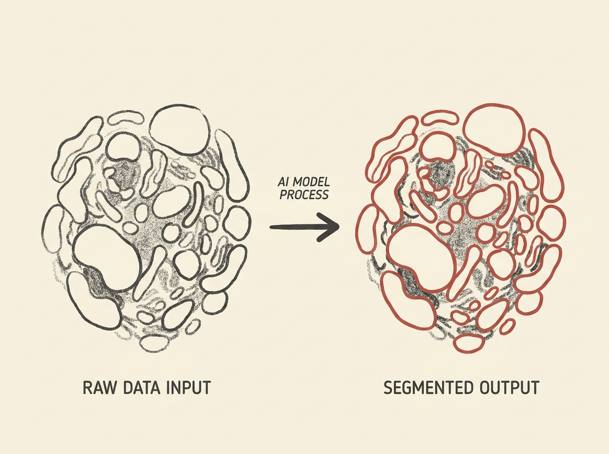

---
authors:
- surprisetalk
comments: https://news.ycombinator.com/item?id=48995074
date: '2026-07-21'
hn_id: '48995074'
image: 69-hn-48995074-infographic.png
interest_score: 7
section: ai
source: hn
tags:
- advanced-light-source
- ai-models
- catchup
- data-volume
- hn
- image-segmentation
- scientific-data-analysis
title: Meta AI models accelerate scientific data analysis for research facilities
url: https://ai.meta.com/blog/genesis-mission-lawrence-berkeley-national-laboratory-segment-anything-dino/?_fb_noscript=1
why_read: This article explains how Meta's AI models are being utilized to process
  massive scientific datasets, particularly for image segmentation, enabling real-time
  analysis for advanced research facilities like the Advanced Light Source.
---

Scientific research is drowning in data, especially from high-resolution instruments generating petabytes annually. Manual analysis, particularly for image segmentation, simply cannot keep up. Imagine millions of gigabytes of data demanding real-time interpretation. Meta AI is stepping in.Meta's Segment Anything Model (SAM) and DINOv2 are being deployed at Lawrence Berkeley National Laboratory. These models automate the identification and precise boundary drawing of structures within images, a task that previously overwhelmed human domain experts.This is not just academic; it is applied AI directly tackling a critical bottleneck. It shows how advanced vision models can move from research to solving genuinely massive, real-world data problems.