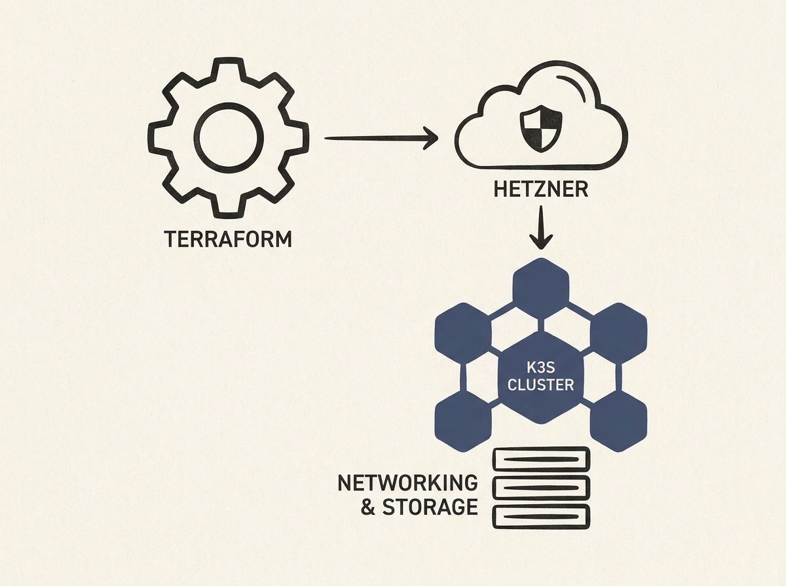

---
authors:
- victorbrink
comments: https://news.ycombinator.com/item?id=48996128
date: '2026-07-21'
hn_id: '48996128'
image: 70-hn-48996128-infographic.png
interest_score: 7
section: systems
source: hn
tags:
- catchup
- cost-efficiency
- data-sovereignty
- hetzner-cloud
- hn
- k3s
- kubernetes
- self-hosting
- terraform
title: Terraform simplifies production K3s deployment on Hetzner Cloud
url: https://blog.qstars.nl/posts/cheap-self-hosted-kubernetes-on-hetzner-cloud/
why_read: This article demonstrates how to deploy a cost-efficient, production-ready
  K3s cluster on Hetzner Cloud using Terraform. Readers will learn about a self-hosting
  alternative to hyperscalers, prioritizing cost, reliability, and data sovereignty.
---

Building a production-ready Kubernetes cluster does not have to break the bank or overwhelm your team. The `terraform-hcloud-kube-hetzner` project offers a smart way to get a K3s cluster running on Hetzner Cloud.This open-source Terraform module simplifies deployment while focusing on reliability and cost efficiency. It leverages Hetzner's reputation for high-performance hardware at predictable prices, making it a solid choice for those seeking to avoid hyperscaler vendor lock-in without sacrificing automation.This is an excellent resource for engineers looking to gain hands-on experience with self-hosted Kubernetes in a cost-effective manner. You get proper automation, private networking, load balancers, and network attached storage on a platform that offers data sovereignty benefits.