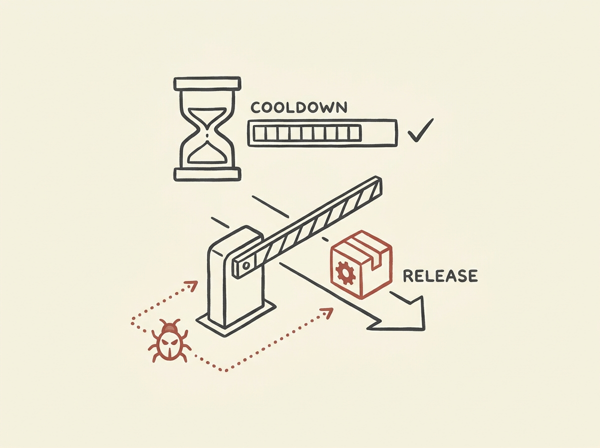

---
authors:
- outloudvi
comments: https://news.ycombinator.com/item?id=48993885
date: '2026-07-21'
hn_id: '48993885'
image: 71-hn-48993885-infographic.png
interest_score: 7
section: engineering
source: hn
tags:
- catchup
- community-vetting
- hn
- package-managers
- release-cooldown
- security-theater
- supply-chain-security
title: Package Manager Release Cooldowns Are Ineffective Security Theater
url: https://blog.outv.im/2026/npm-cooldown-security-theater/
why_read: This article argues that package manager release cooldowns are ineffective
  security theater. Readers will learn why these measures fail to enhance supply chain
  security and can instead create a false sense of protection.
---

Are package manager release cooldowns truly enhancing security or just creating a false sense of it? This article critically examines the widespread practice of time-gating new package releases.

The author argues that these cooldowns often amount to 'security theater,' failing to prevent sophisticated supply chain attacks while unnecessarily slowing down development workflows. The core issue is that no one is truly vetting these packages during the cooldown period; everyone waits for someone else, or automated CI/CD pipelines are exploited before human review even occurs.

This perspective challenges a common industry assumption, urging us to reconsider whether these measures provide genuine protection or merely add friction. It is a worthwhile read for anyone interested in effective engineering practices and developer productivity.