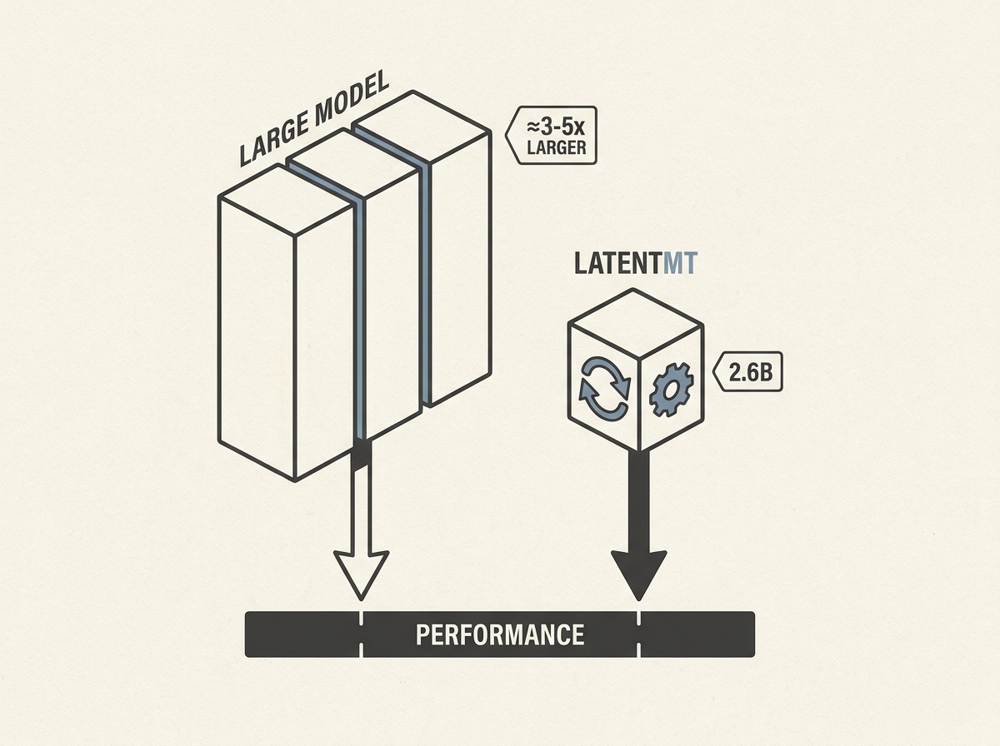

Scaling LLMs usually means bigger models or more explicit chain-of-thought tokens. LatentMT proposes a different, compelling path: latent reasoning within hidden states. This approach uses additional recurrent computation internally rather than expanding parameter count. This allows a relatively small 2.6B-parameter model to achieve performance on par with models three to five times larger. The efficiency gains are significant, with lower training and inference compute requirements. It demonstrates that recurrent computation consistently improves translation quality, suggesting that compact, efficient, and strong LLMs are possible without the usual scaling trade-offs. This could significantly impact the feasibility of deploying powerful LLMs in resource-constrained environments. It is a smart way to get more out of less.