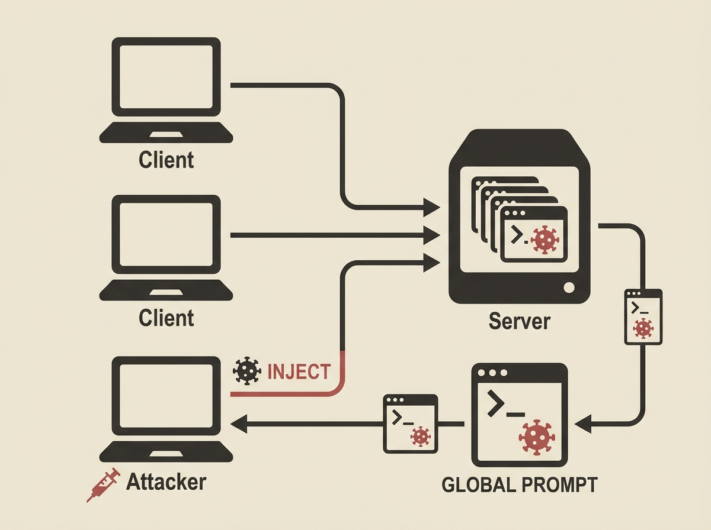

Collaborative prompt optimization sounds great, right? Multiple clients improving prompts while keeping data local. But what if those prompts become a vector for malicious instructions? CPInj uncovers a serious prompt injection risk in this decentralized setting. Malicious instructions can not only be injected but also propagate through server-side aggregation and persist through benign optimization. Standard defenses are ineffective. This is not about general web security, but a specific, practical vulnerability in the *system design* of collaborative LLM workflows. It highlights the need for robust aggregation methods, like the proposed APAgg, to purify prompts. For anyone building or deploying LLM-powered applications, especially in collaborative environments, this is a must-read to understand the attack surface. It is a stark reminder that even seemingly innocuous collaboration can hide critical vulnerabilities.