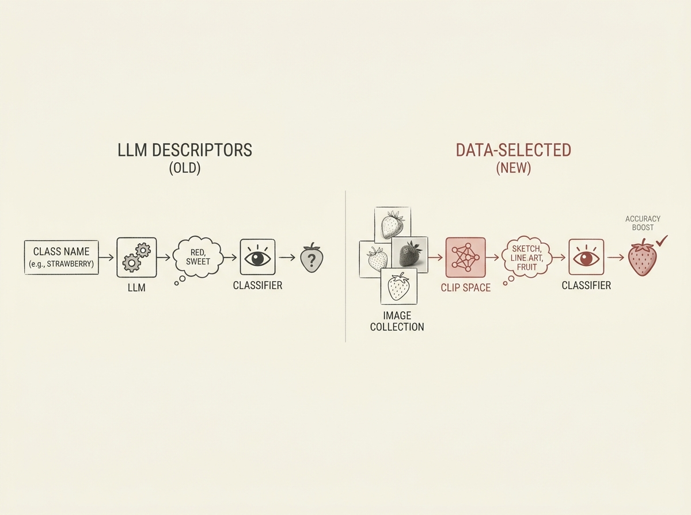

Do not let large language models (LLMs) describe your image classes for zero-shot classification; it actually hurts performance.

A popular method for interpretable zero-shot classification involves asking an LLM to generate class descriptors, which are then used to prompt Vision-Language Models like CLIP. This paper demonstrates a critical flaw: these LLM-generated descriptors are conditioned on the *label*, not the *images*, leading to misleading information when data distributions shift. For example, an LLM insists strawberries are red, but in ImageNet-Sketch, they are line drawings.

By instead selecting attributes directly from the target image collection using CLIP's joint embedding space, this new approach significantly boosts ImageNet accuracy by 8.3 points over LLM descriptors, without the class name in the prompt. This method even outperforms prompt-tuning like CoOp by 3 points, running in minutes rather than hours, and provides a clear, data-driven summary of the dataset. This is a valuable insight for anyone working with VLMs and prompt engineering.