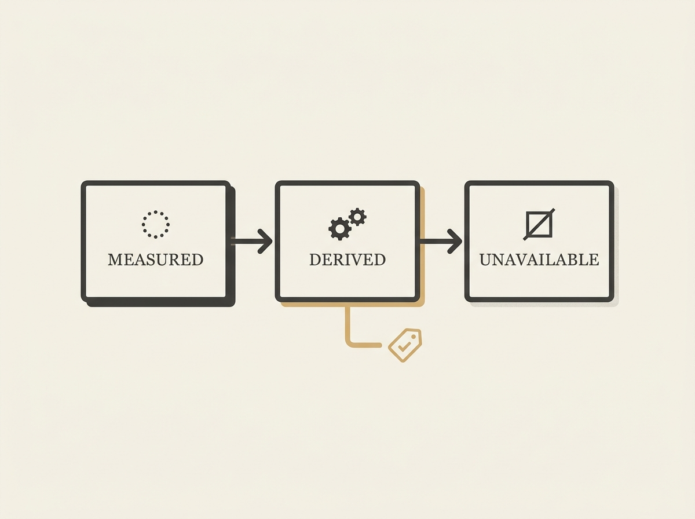

Building robust applied AI systems requires more than just good models; it demands excellent engineering practices, especially around transparency.

Caption Studio, a speech and audio intelligence platform, adopts a 'transparency-first' framework. This means every reported metric (from transcription accuracy to sentiment analysis) is explicitly identified as either measured, derived, or unavailable.

This simple, yet powerful, practice significantly improves the traceability, interpretability, and reliability of speech analytics. It provides a clear, auditable trail for how insights are generated, crucial for enterprise-scale deployments. For any senior engineer building complex AI applications, adopting such a transparency framework for metrics can be a game-changer for trust and debugging.