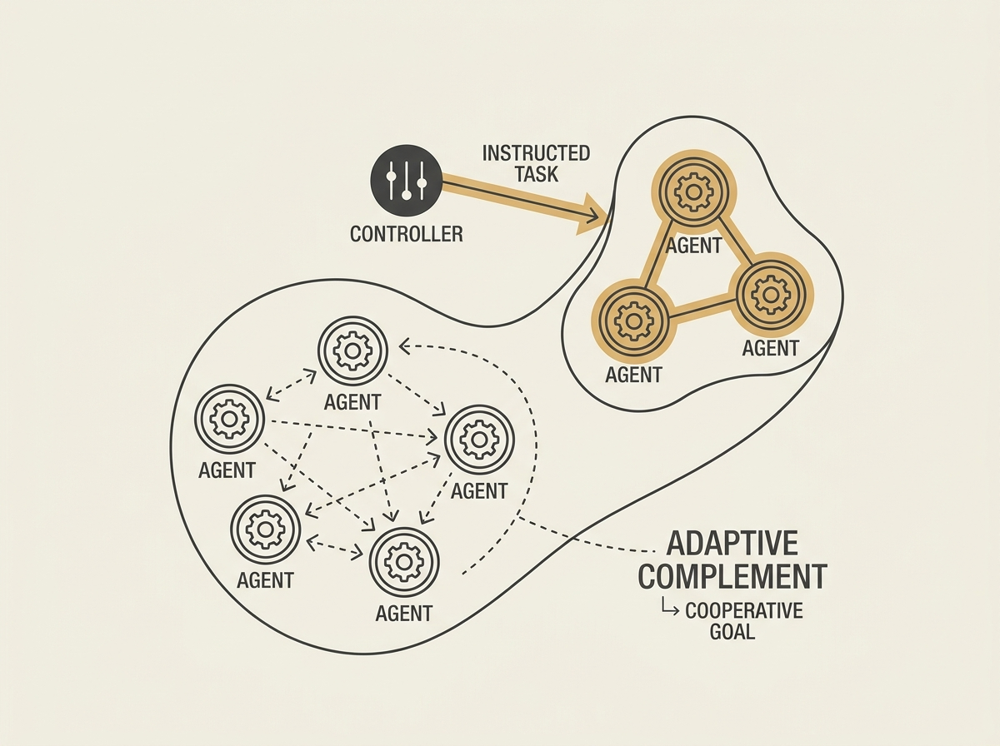

Designing multi-agent systems that seamlessly integrate human guidance with autonomous adaptation is a core challenge for practical AI agents.

This paper introduces a novel deep reinforcement learning method where human managers can instruct specific agents, while other uninstructed agents implicitly and adaptively complement the overall task. This approach tackles the problem of designing better cooperation regimes without needing to instruct every single agent.

Experiments show that agents using this method can shift to new cooperative structures and achieve better performance compared to conventional approaches. This opens up possibilities for more flexible and human-friendly multi-agent applications, especially where complex tasks require a mix of explicit control and intelligent autonomy.