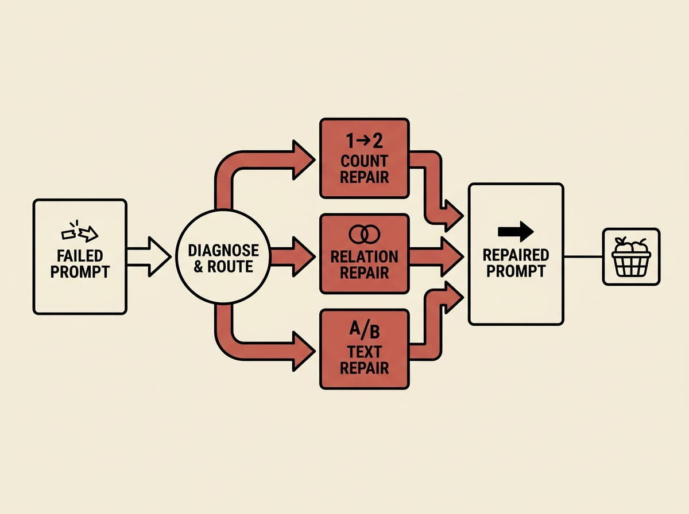

Text-to-image (T2I) generators often fail to follow prompts faithfully, creating wrong counts, swapped attributes, or illegible text. Existing prompt optimization methods often use a uniform expansion, but different failures require different fixes.

This paper introduces Type-Aware Repair Allocation (TARA), a training-free framework that diagnoses failures and routes each failed proposition to a specific, type-conditioned repair operator. For example, a 'wrong count' failure might get a numerical adjustment, while an 'ambiguous relation' gets a more descriptive rewrite.

TARA significantly boosts semantic accuracy by 5.6 and 2.6 points on DSG and TIFA benchmarks over baselines like VisualPrompter, while maintaining image quality and running faster. For engineers building applications with generative AI, this is a practical and effective method to achieve more reliable T2I outputs without costly model retraining.