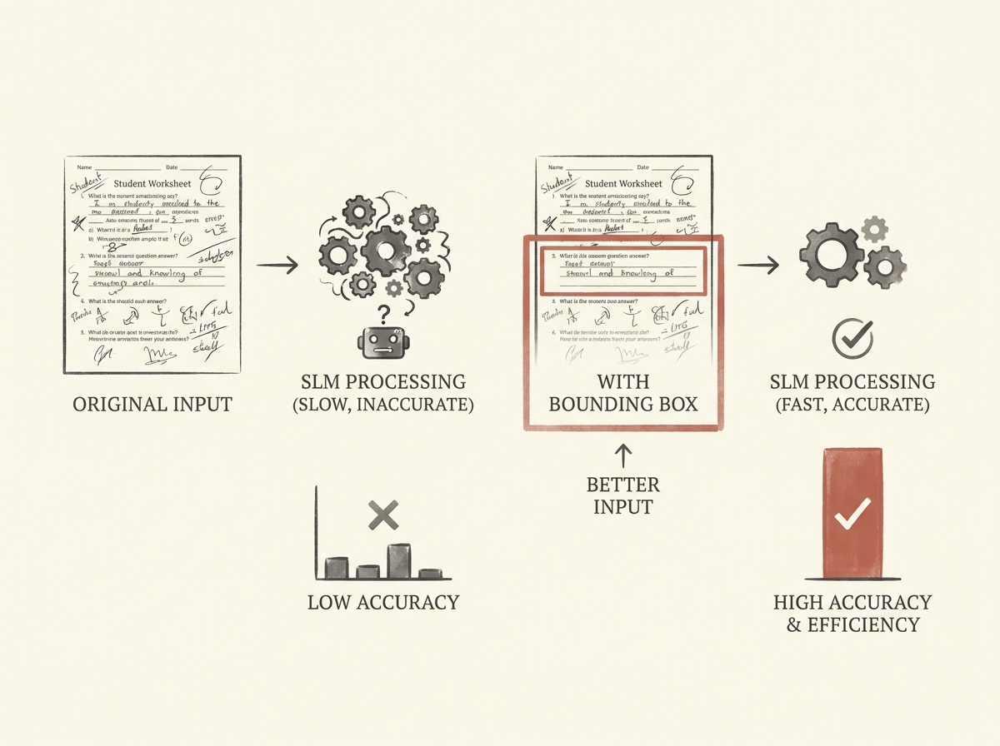

Small Language Models (SLMs) often struggle with complex vision-based tasks due to large image sizes and visual clutter. A simple yet powerful pre-processing technique involves using bounding boxes to crop student responses for grading tasks.

This approach significantly improves grading accuracy and reduces computational cost (FLOPs) across a range of SLMs, from 4B to 72B parameters. The agent gets a cleaner, more relevant context, making it more effective.

Sometimes, the best AI optimization is better input, not a bigger model.