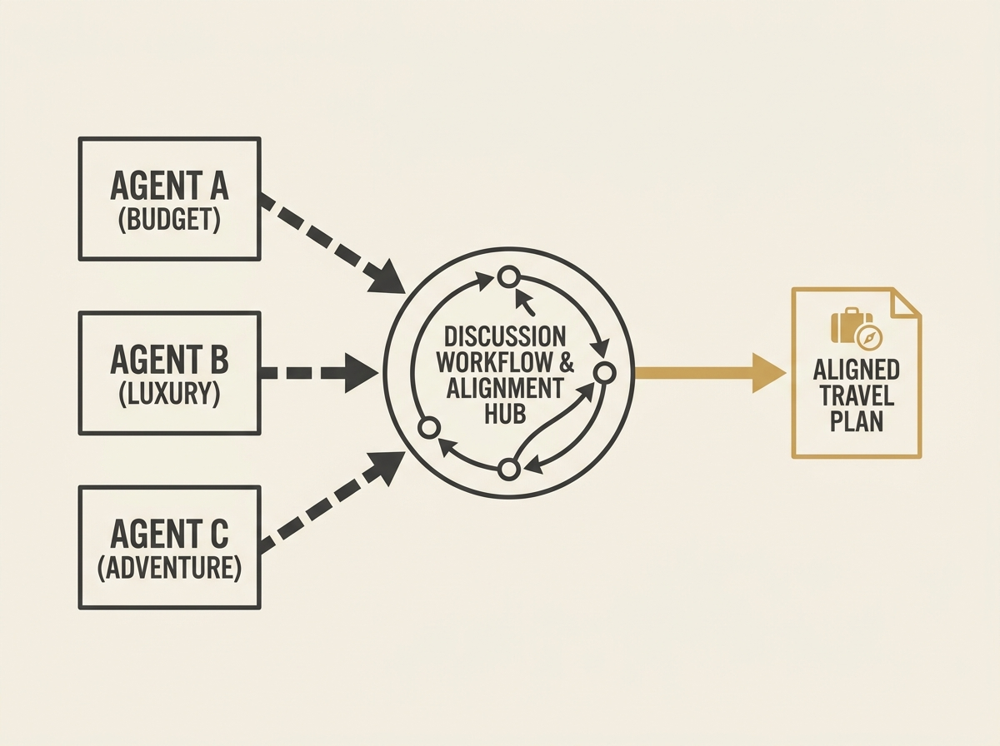

Imagine LLM agents planning complex group travel, negotiating constraints, and aligning preferences through natural language discussion. AI Tour Meeting is a new framework designed for exactly this: simulating multi-agent collaboration.

It allows you to instantiate agents with distinct personas and configure their discussion workflows, offering a powerful tool to analyze how LLM agents behave during collaborative problem-solving. This moves beyond single-agent tasks to truly interactive, multi-agent scenarios.

Understanding multi-agent dynamics is key to building advanced AI teams.