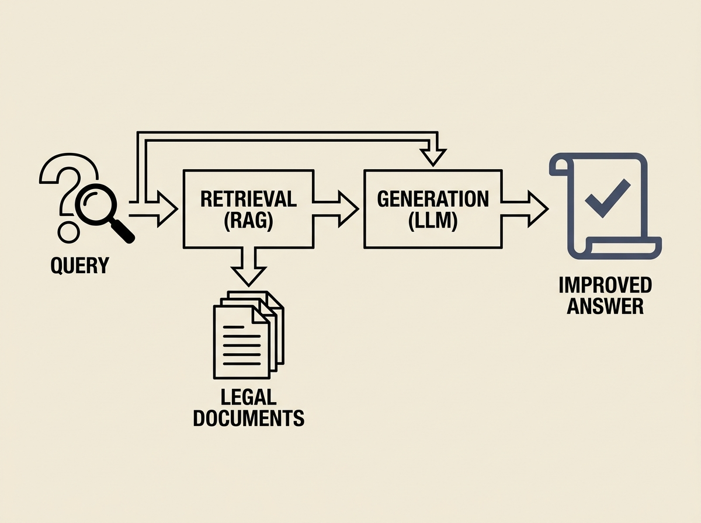

Deploying AI in high-stakes domains like legal question answering reveals critical insights into applied LLMs. AILQA, a system tailored for the Indian legal context, demonstrates how Retrieval-Augmented Generation (RAG) significantly improves answer quality.

The study, validated by legal experts, highlights RAG's effectiveness in providing relevant supporting details for complex legal queries. However, it also underscores persistent challenges like the need for precise context and managing model hallucination.

RAG is powerful, but context is king, especially in law.