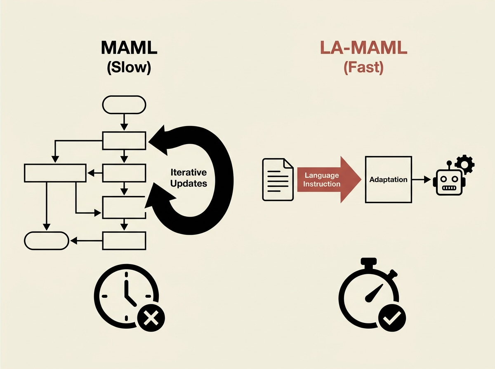

Training AI agents with Meta-Reinforcement Learning (MAML) can be notoriously slow, requiring extensive trajectory collection and gradient updates in its inner loop. A new paper introduces LA-MAML, which ingeniously replaces this bottleneck with language instructions.

The researchers found that by embedding task instructions and using them directly for adaptation, they could achieve competitive or even superior performance. Crucially, this dramatically reduces the per-iteration training time.

This approach offers a significant efficiency boost for adaptable AI agents. It highlights how integrating natural language can unlock practical performance gains in complex reinforcement learning scenarios, making agent development faster and more feasible.