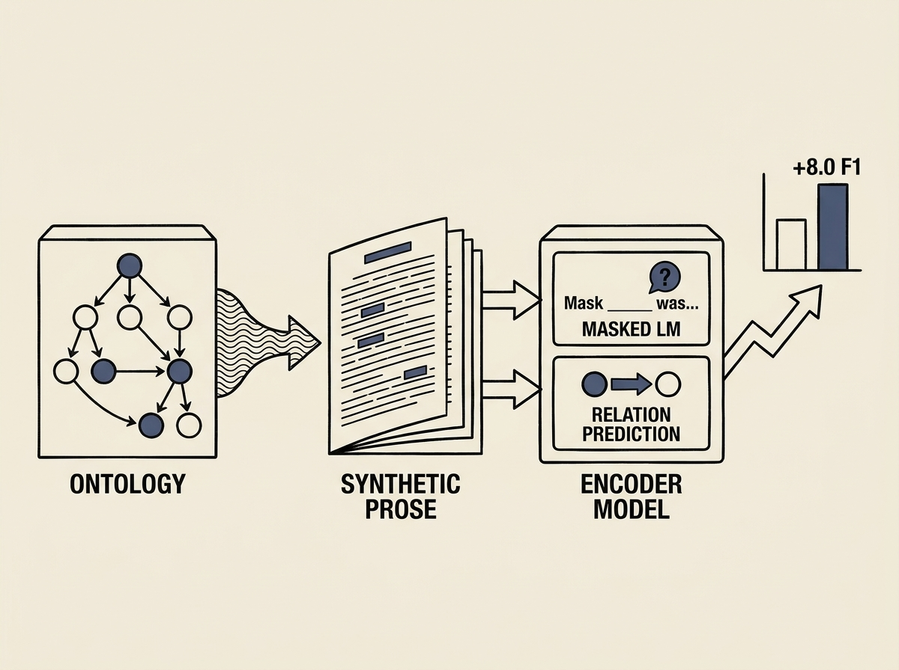

Building effective domain-specific LLMs often hits a wall due to scarce high-quality data. This paper presents a smart solution for medical applications: OntoBook.

It leverages existing medical ontologies, generating "textbook-style" prose that encapsulates hierarchical and causal relations between medical codes. This synthetic data is then used to pretrain encoders with masked language modeling and relation prediction.

The results are significant, with up to +8.0 micro-F1 on benchmarks like Distemist-FR. This approach offers a powerful strategy for anyone facing data scarcity in specialized domains, showing how to create rich pretraining signals from structured knowledge.