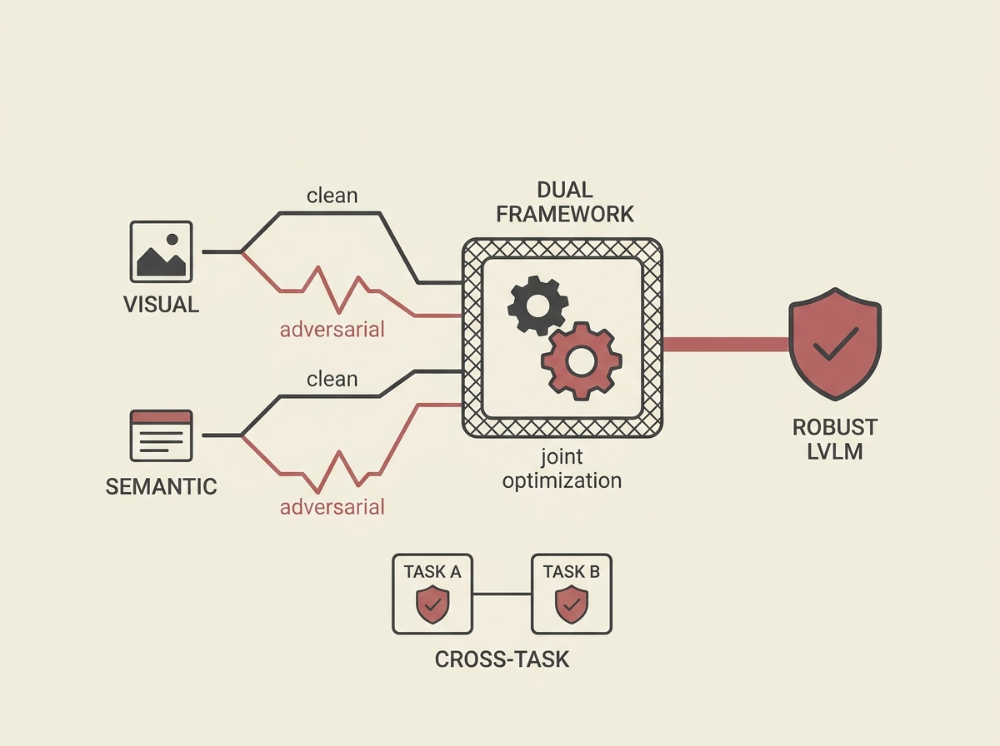

Deploying Large Vision-Language Models (LVLMs) comes with a significant challenge: their vulnerability to adversarial attacks. Existing defenses often fall short, lacking generalizability across different multimodal tasks.

This paper introduces a dual adversarial fine-tuning framework that tackles this head-on. It jointly optimizes visual and semantic supervision signals, leveraging features from clean images and incorporating caption-image alignment to preserve semantic coherence even under attack.

Crucially, this method achieves cross-task robustness by simply replacing the CLIP vision encoder, eliminating the need for separate task-specific retraining. This is a practical step towards building more reliable and secure applied AI systems.