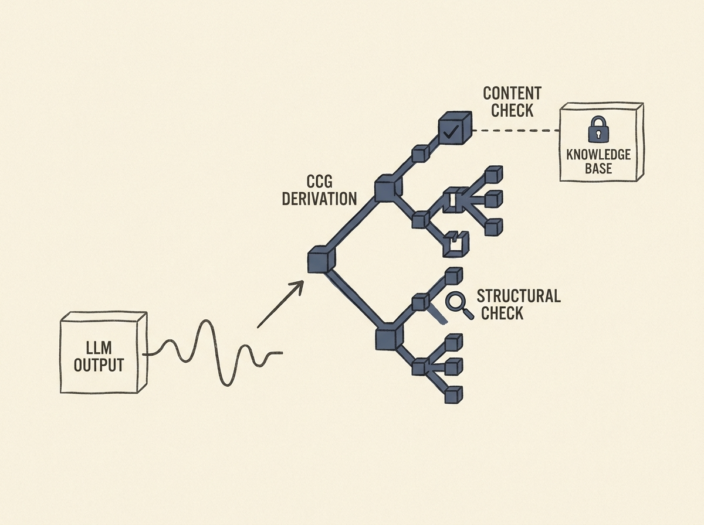

A major hurdle for production-grade LLMs is ensuring their outputs are not only fluent but also structurally sound and free from hallucinations. This paper introduces an intriguing neurosymbolic framework leveraging Combinatory Categorial Grammar (CCG).

The approach "lifts" LLM outputs into typed compositional derivations, offering a principled, incremental, and auditable reconstruction. This is not about claiming LLMs *implement* CCG, but that their outputs *admit* such a reconstruction.

This framework enables two layers of checking: a compositional layer for structural failures and a content layer against external knowledge sources. What is particularly powerful is its applicability to formal languages like SQL or OWL, offering a robust way to validate LLM-generated code or queries.