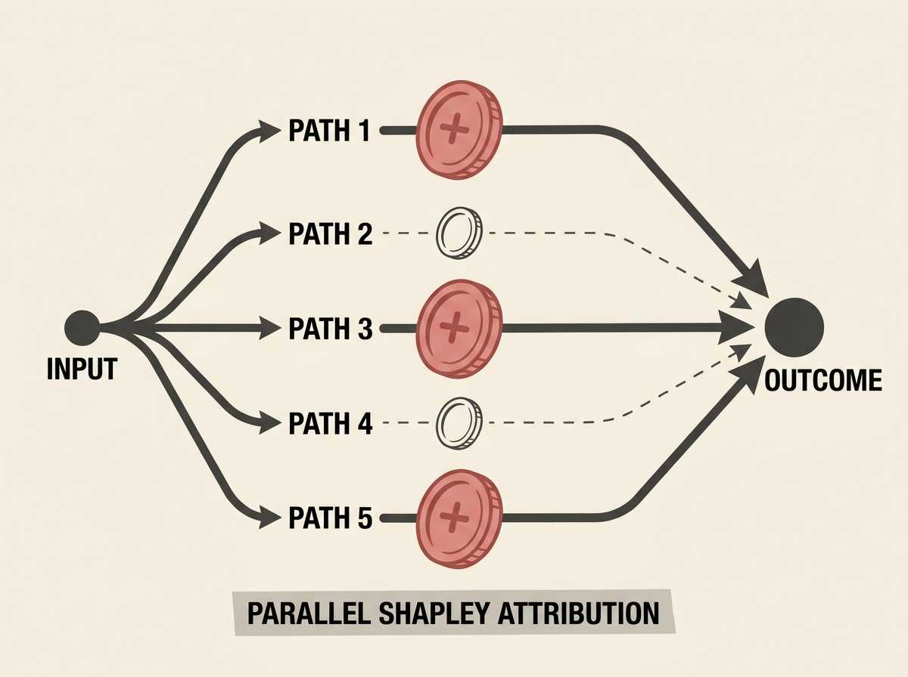

When LLMs engage in parallel reasoning, it is difficult to identify which individual reasoning paths truly contribute to a successful outcome versus those that are redundant or misleading. Traditional outcome-level rewards often obscure these individual contributions.

This paper introduces 'Parallel Shapley,' an innovative reinforcement learning framework that leverages Shapley values from cooperative game theory. Each reasoning path is treated as a player, and Shapley values quantify their marginal contribution to the overall success.

By attributing fine-grained, path-level rewards, the framework effectively 'fishes out the free riders,' ensuring that rewards are proportional to actual contribution. This leads to more stable and interpretable training, significantly outperforming existing baselines on mathematical reasoning benchmarks.

This approach offers a powerful method for improving the efficiency and robustness of multi-path reasoning in LLMs, ensuring that your agents learn from the right signals.