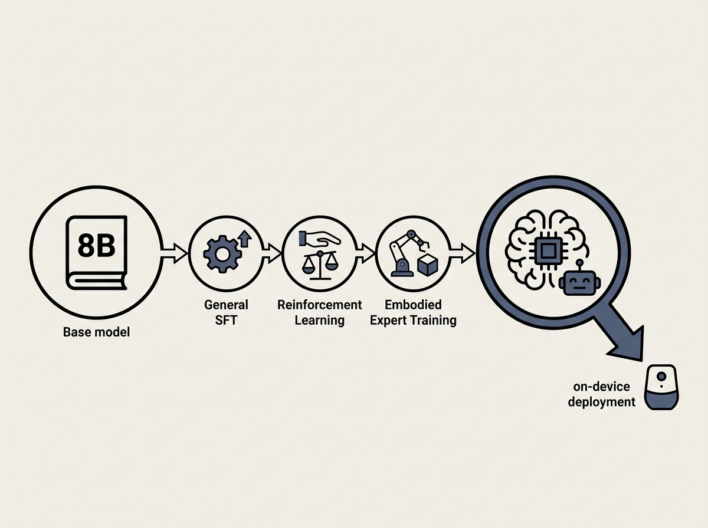

Deploying capable LLMs on-device for embodied agents presents a significant challenge: how do you maintain general intelligence while ensuring efficient, specialized interaction in a resource-constrained environment?

This paper introduces Athena-Brain-8B, an 8-billion-parameter LLM engineered specifically to serve as an on-device brain. It achieves this balance through a multi-stage post-training pipeline, combining general supervised fine-tuning, reinforcement learning, embodied expert training, and model merging.

Athena-Brain-8B not only retains strong general language and reasoning capabilities but also excels in high-level embodied interaction, generating significantly shorter and more efficient responses. This is a crucial design consideration for any edge AI deployment where latency and token usage are critical.

If you are developing for embodied AI or considering deploying LLMs to the edge, Athena-Brain-8B demonstrates a viable path to integrating broad intelligence with practical on-device performance.