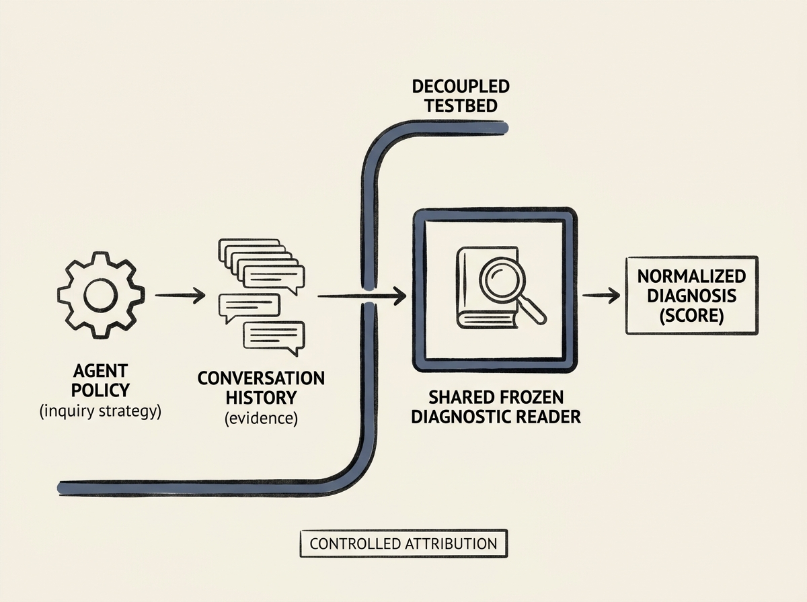

Evaluating multi-turn AI agents, especially in complex domains like medical consultation, is notoriously difficult. Their inquiry strategy is often conflated with their final decision-making, making it hard to pinpoint true performance bottlenecks.

MedDDC-Eval introduces a 'diagnosis-decoupled' testbed that cleanly separates these concerns. It treats the agent's elicited conversation history as the primary object of comparison, using a shared, frozen diagnostic reader to normalize the history-to-diagnosis mapping. This eliminates confounding variables and allows for precise attribution of performance.

This methodology reveals that simply changing the diagnostic reader can shift diagnosis F1 scores by 2.2 to 19.0 points and reverse up to 36 percent of pairwise policy orderings. This indicates that without such decoupling, evaluations can be highly misleading.

For any engineer developing or evaluating sophisticated multi-turn agents, this framework offers a more reliable and interpretable way to measure agent effectiveness and guide policy development.