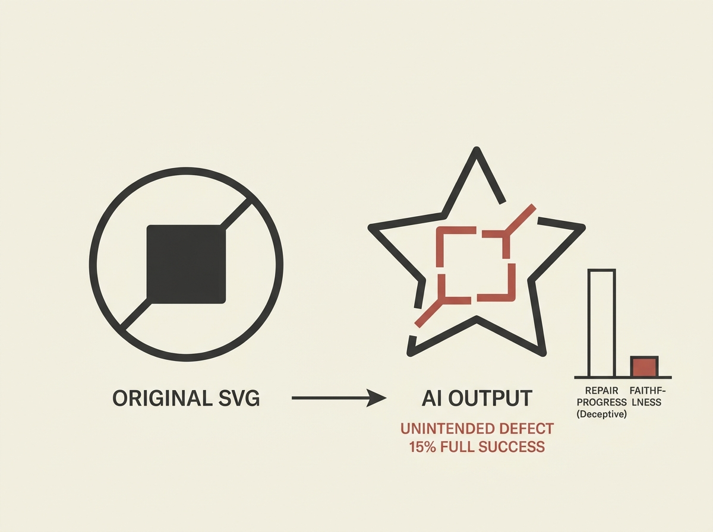

Building AI to edit code based on instructions seems straightforward, but there is a critical hidden challenge: models must make *only* the requested changes and leave everything else untouched. This new "Vector-Bench" benchmark reveals a major gap.

Focused on SVG code editing, the benchmark shows that even the strongest models achieve only 15 percent full specification success. They might fix the instructed defect, but frequently introduce unintended changes elsewhere. This is despite a seemingly high "repair progress" score.

This finding is vital for anyone designing AI agents or systems that interact with structured code. It underscores that robust LLM-driven code generation and editing requires not just understanding the positive instruction, but also implicitly understanding the vast negative space of what *not* to change.