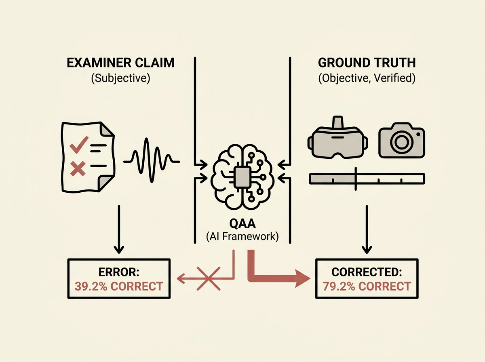

Subjectivity and bias often plague high-stakes human assessments, even in critical fields like clinical medicine. This paper introduces "Quality Action Assurance" (QAA), a multimodal AI framework designed to objectively verify examiner claims in VR clinical exams (OSCEs).

QAA ingeniously combines video analysis, virtual reality logs, and large language models. It performs precise temporal action alignment, localizing actions and attributing them to specific actors, then uses an LLM to extract examiner claims and cross-reference them against the ground truth.

This system identifies examiner errors with 70 percent precision and 76.7 percent recall, boosting factual correctness from 39.2 percent to 79.2 percent. It showcases a powerful application of applied AI for quality assurance, moving beyond inter-rater statistics to truly understand and correct assessment discrepancies.