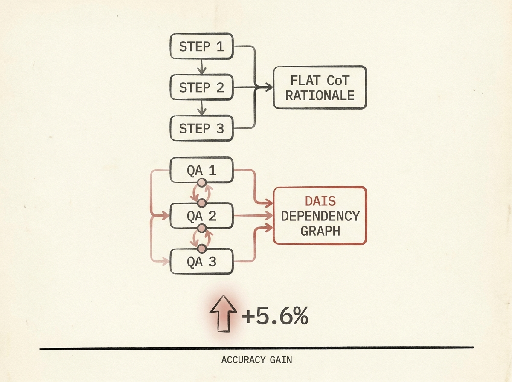

Elevating LLM complex reasoning just got a new method: Dependency-Aware Intermediate QA Supervision (DAIS). This training framework goes beyond flat Chain-of-Thought rationales by creating stage-level QA records that explicitly condition local answers on previous reasoning states.

The innovation here is in how the supervision is structured. Instead of a single reasoning sequence, DAIS builds a dependency graph, ensuring that each intermediate step directly supports subsequent decisions.

Across various benchmarks (GDPR, AIACT, MedQA), DAIS achieved notable gains, improving final-answer accuracy by up to 5.6% and an average of 4.2% over strong baselines. This shows that explicit dependency awareness during training can make a significant difference in how LLMs approach and solve multi-step problems.

If you are serious about pushing the boundaries of LLM reasoning, this is a technique to consider for your training pipelines.