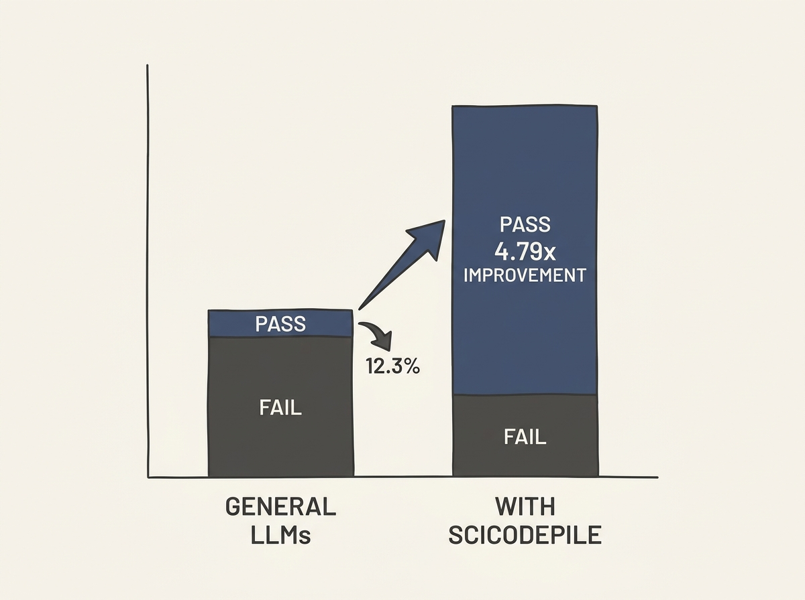

While LLMs excel at general code generation, their performance on *scientific* code remains a significant challenge. A new resource, SciCodePile, sheds light on this gap.

SciCodePile is a massive 128GB corpus of scientific code, coupled with a 200-task executable benchmark. Evaluations reveal that even the strongest models achieve only a 12.30% Pass@1 score, underscoring how far we are from reliable scientific code generation.

However, there is a clear path forward. The research shows that continued pretraining on the SciCodePile corpus can improve CodeBLEU by 2.84 times, and instruction tuning can boost Pass@1 by 4.79 times.

This is a crucial insight for anyone developing LLMs for specialized domains. Tailored datasets and benchmarks are key to unlocking higher performance and addressing specific limitations.