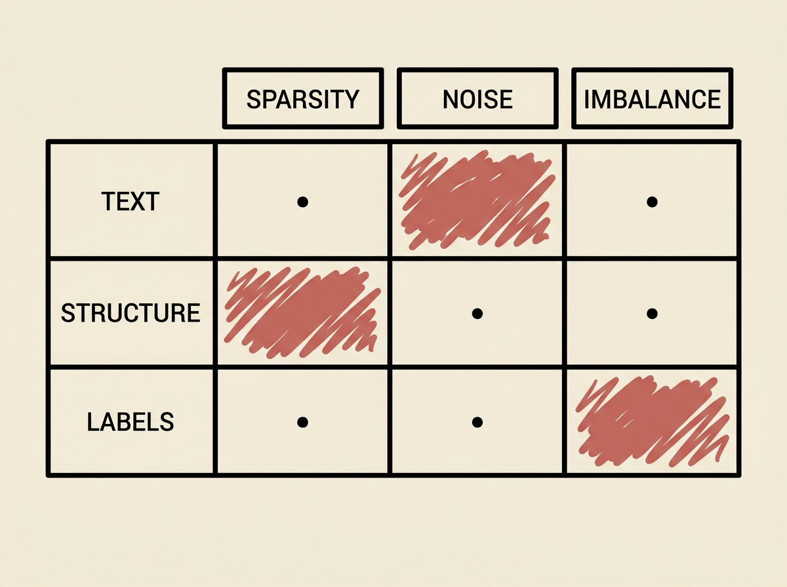

Data quality degradation is a silent killer for many machine learning models in production. For Text-Attributed Graphs (TAGs), understanding robustness under real-world imperfections is critical, and OpenRTAG offers a comprehensive benchmark.

OpenRTAG introduces a unified 3x3 taxonomy of TAG quality issues: sparsity, noise, and imbalance across text, structure, and labels. This framework allows for systematic evaluation of various graph neural networks, including emerging LLM-GNNs, under nine distinct degradation scenarios.

The benchmark provides a standardized testbed to assess model sensitivity, compare different architectures, and investigate the effectiveness of mitigation strategies. This is not just about academic performance; it is about building reliable, production-grade systems that can handle imperfect data gracefully.

If you work with graph data and AI, OpenRTAG is an invaluable resource to stress-test your models and improve their resilience.