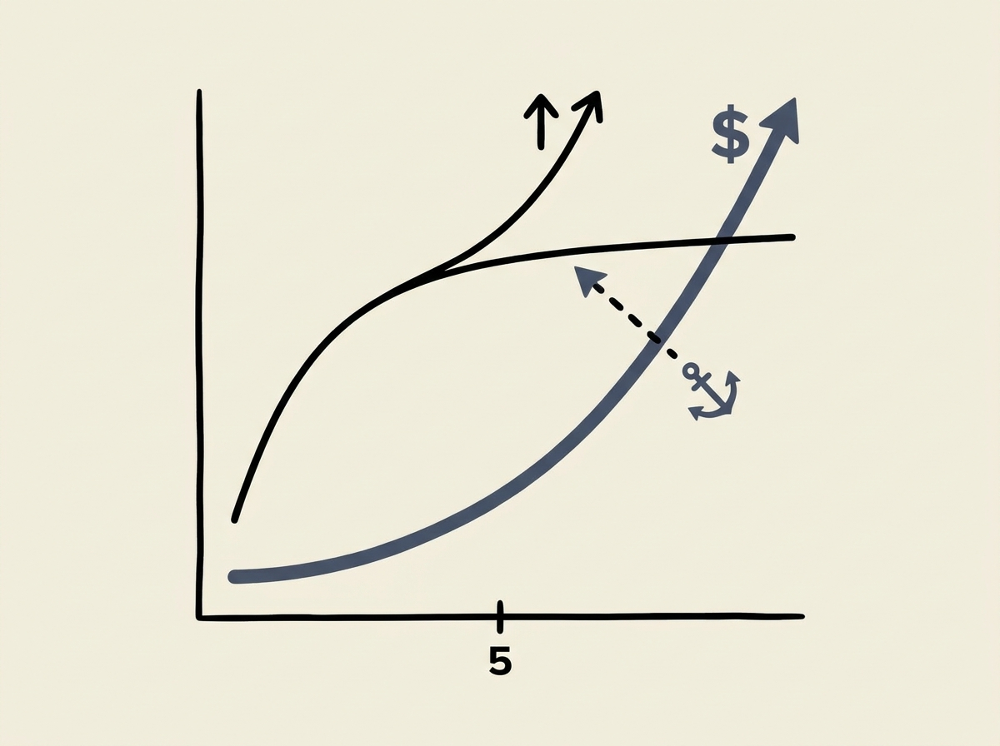

When designing multi-agent AI systems, choosing the right algorithm and scaling it effectively are critical. A recent comparative study sheds light on shared-experience multi-agent actor-critic algorithms.

The research evaluated multi-agent extensions of Greedy Actor-Critic (GAC), Soft Actor-Critic (SAC), and Truncated Quantile Critics (TQC), using a shared replay buffer but independent policy and value networks. They found that a multi-agent framework consistently improved GAC's performance.

However, the gains for MASAC and MATQC were more modest compared to their single-agent versions. Crucially, the study revealed diminishing returns: increasing the number of agents beyond five yielded limited additional performance while substantially raising computational costs, especially for MAGAC.

This highlights a key trade-off for engineers: simply adding more agents does not always translate to linear performance gains and can quickly become computationally prohibitive. Optimal agent count is a design decision with real consequences.