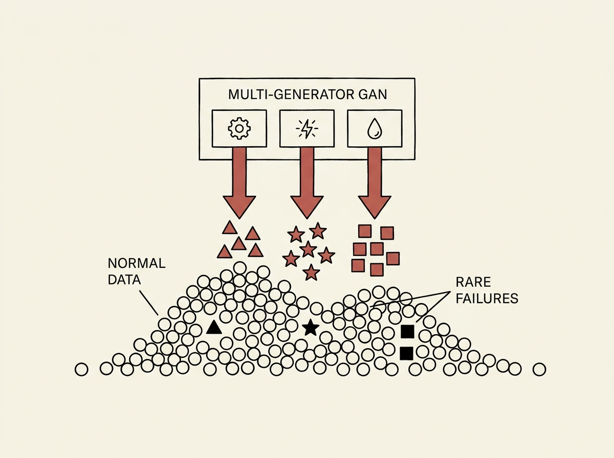

Detecting rare but critical failures in industrial predictive maintenance is a perennial challenge due to highly imbalanced datasets. Traditional methods often fall short because they assume a homogeneous minority class, ignoring that different failure modes have distinct characteristics. This paper breaks that assumption.