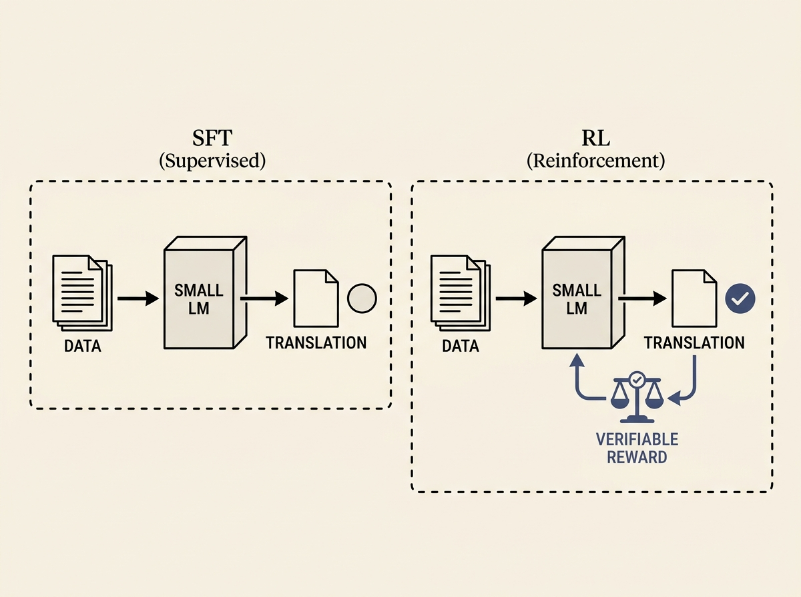

Enhancing smaller language models for high-stakes tasks like legal machine translation requires more than just scaling up. This paper dives into practical strategies, comparing supervised fine-tuning (SFT) and reinforcement learning (RL) with verifiable rewards.