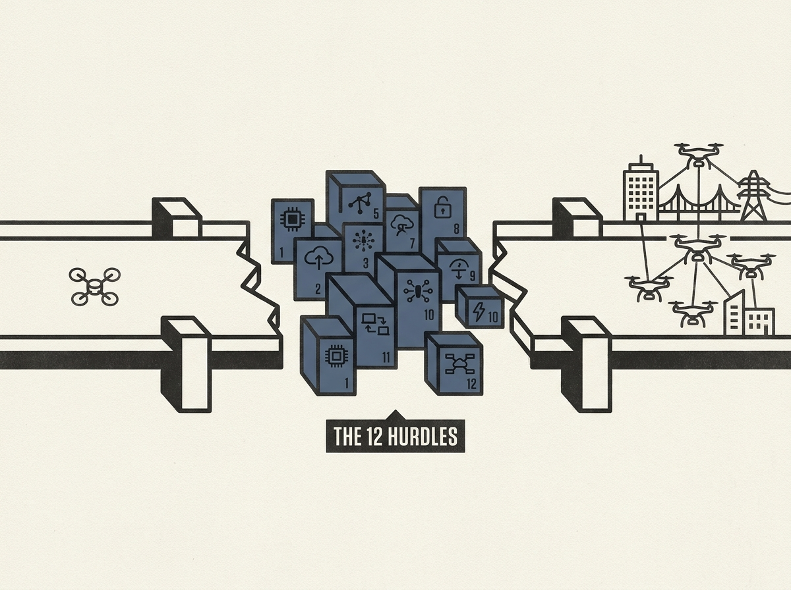

The future of drone computing is not just about hardware; it is about solving monumental software and system design challenges to operate safely at scale. A new report envisions a world where drones deliver goods and inspect infrastructure, but highlights a critical "capability gap."

It identifies twelve technical hurdles, many directly relevant to senior engineers. Think scaling to millions of drones, ensuring AI intelligence and assurance, building edge-cloud continuums, and developing reliable fleets from non-deterministic agents.

This is a forward-looking roadmap for anyone interested in truly pushing the boundaries of distributed systems and autonomous AI.