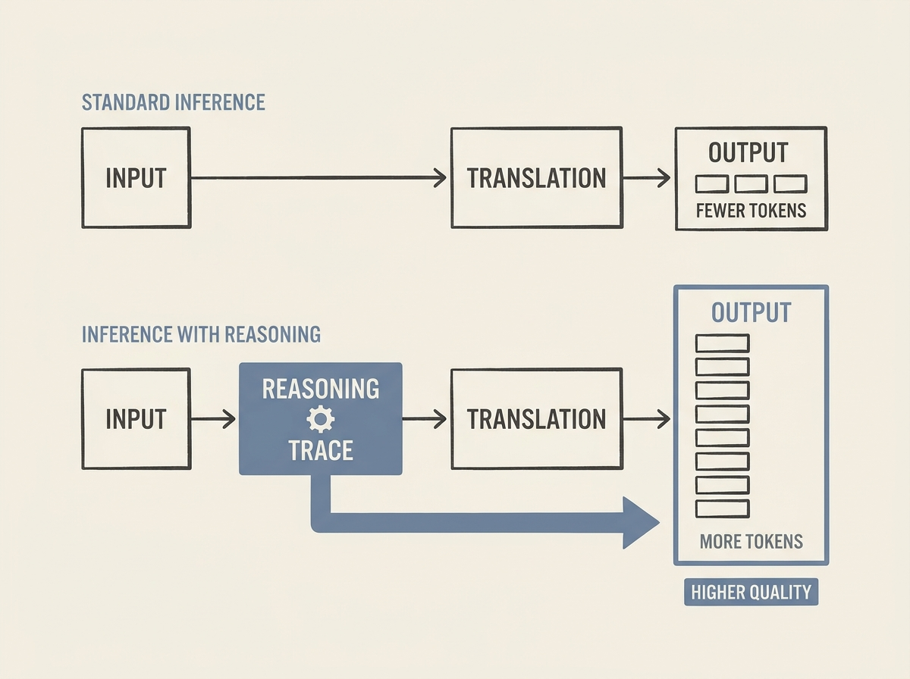

Integrating reasoning capabilities into LLMs for tasks like Neural Machine Translation comes with a tangible cost, and understanding this trade-off is crucial for practical deployment. New research investigates the impact of including reasoning traces during both training and inference.

The findings show that while explicit reasoning does positively affect translation quality, especially during inference, it also leads to a significant increase in output tokens. This means higher computational demands and, consequently, higher operational costs.

Engineers working with applied AI need to carefully consider this balance. Maximizing quality might mean accepting higher token usage, or finding smarter ways to inject reasoning without ballooning costs.