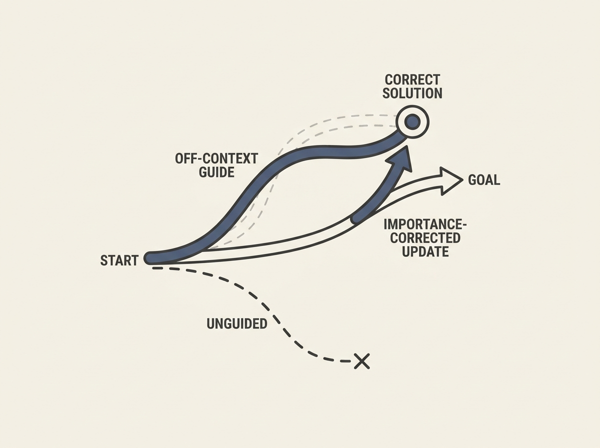

LLMs often hit a "learning cliff" on hard reasoning problems, receiving zero signal because they cannot generate any correct solutions. A new technique, Off-Context GRPO (OC-GRPO), tackles this by providing privileged guidance during training.

OC-GRPO uses "off-context" guided rollouts, like solution prefixes, to steer the model towards correct solutions. It then applies an importance-corrected objective to bring the update back to the original unguided goal, avoiding training mismatch.

This method achieves a 13.8 percent relative gain on mathematical reasoning benchmarks, offering a practical way to improve LLM capabilities on tasks where traditional reinforcement learning with verifiable rewards struggles. It is a smart approach to training more capable and robust LLMs.